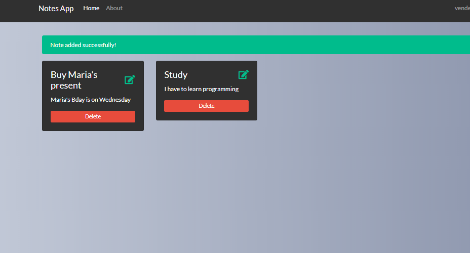

# Notes App

# Notes App with Node, Mongodb
This is a basic App to manage simple Notes on the web using Javascript Technologies like Nodejs, Mongodb, and so on.
This app can:
- create/read/update/delete Notes
- Allows a user to do log in and save his personal notes

## Requirements
- Node.JS
- MongoDB
- NPM or Yarn
- Basic knowledge in ES6 (JavaScript)

 

# Get started

## Clone the repository to your machine

You can use git or download it directly from github

## Get the dependencies
Open your cloned folder. Then, using your favorite package manager get the dependencies.

Example using npm

`npm install`

Example using yarn

`yarn`

## Start development server & build

Open your cloned folder. Then, using your favorite package manager run `dev` command.

Example using npm

`npm run dev`

Example using yarn

`yarn dev`

When you done these steps, your default browser should open and redirect you to `localhost:3000`

## License

MIT
